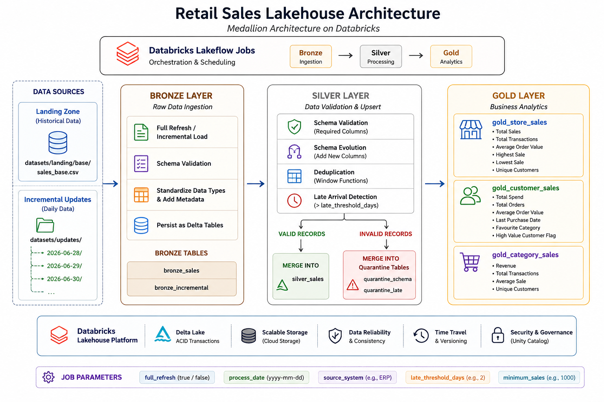
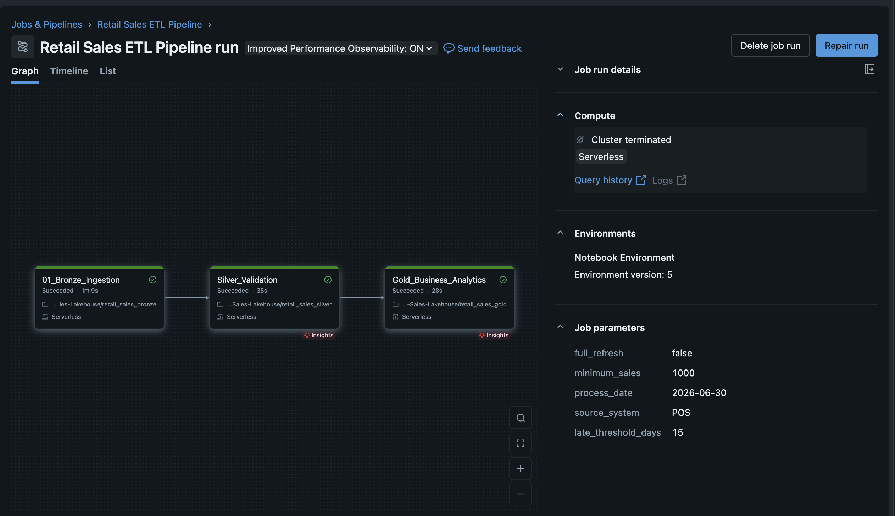
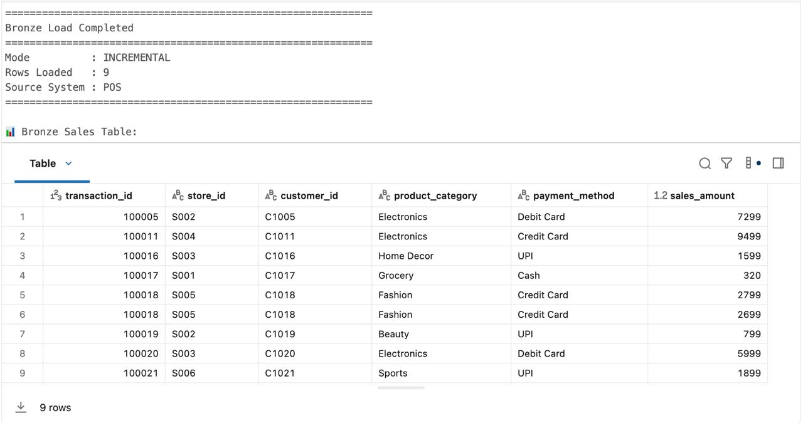
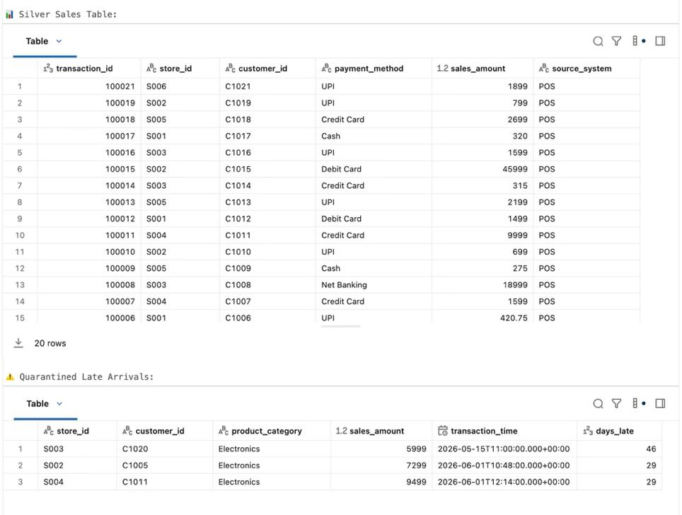
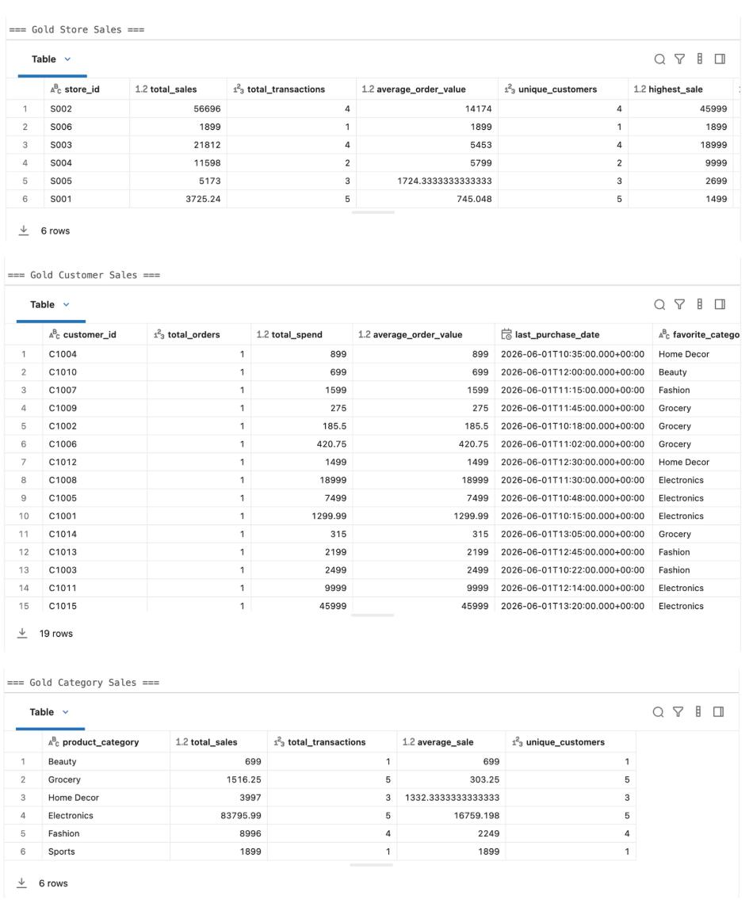

# 🛒 Retail Sales Lakehouse using Databricks Lakeflow Jobs

An end-to-end **Data Engineering** project implementing the **Medallion Architecture (Bronze → Silver → Gold)** using **Databricks**, **PySpark**, **Delta Lake**, and **Lakeflow Jobs**.

The project demonstrates parameter-driven incremental ETL, Delta MERGE operations, schema evolution, late-arriving data handling, fully idempotent processing, and analytics-ready Gold tables.

---

# Architecture

The pipeline follows the Medallion Architecture and is orchestrated using Databricks Lakeflow Jobs.



---

# Lakeflow Job Workflow

The ETL pipeline is orchestrated using **Databricks Lakeflow Jobs**. Each task executes only after the successful completion of its upstream dependency.



---

# Technology Stack

- Databricks
- PySpark
- Delta Lake
- Lakeflow Jobs
- SQL

---

# Repository Structure

```
Retail-Sales-Lakehouse/

│
├── notebooks/
│   ├── retail_sales_bronze.py
│   ├── retail_sales_silver.py
│   └── retail_sales_gold.py
│
├── datasets/
│   ├── landing/
│   │   └── base/
│   │       └── sales_base.csv
│   │
│   └── updates/
│       └── 2026-06-30/
│           ├── update_1.csv
│           ├── update_2.csv
│           └── update_3.csv
│
├── notebook_outputs/
│   ├── bronze_ingestion.html
│   ├── silver_validation.html
│   └── gold_business_analytics.html
│
├── images/
│   ├── architecture.png
│   ├── Lakeflow_DAG.png
│   ├── bronze_output.png
│   ├── silver_output.png
│   └── gold_output.png
│
└── README.md
```

---

# Pipeline Overview

The project simulates a retail sales ingestion pipeline where historical sales data is loaded once and subsequent business data is processed incrementally.

The pipeline follows the Medallion Architecture:

```
Landing Zone
      │
      ▼
Bronze
      │
      ▼
Silver
      │
      ▼
Gold
```

---

# Bronze Layer

## Purpose

The Bronze layer ingests raw CSV files from the landing zone while preserving the source data and adding ingestion metadata.

## Supported Modes

### Full Refresh

Loads the historical snapshot from:

```
datasets/landing/base/
```

Creates or refreshes the baseline Bronze table:

```
bronze_sales
```

---

### Incremental Load

Loads only the CSV files inside

```
datasets/updates/2026-06-30/
```

The update folder is selected dynamically using the Lakeflow Job parameter:

```
process_date
```

This simulates a production-style date-partitioned landing zone where each day's files are processed independently.

---

## Bronze Responsibilities

- Read raw CSV files
- Validate required columns
- Standardize datatypes
- Add ingestion metadata
- Persist Delta Bronze tables

### Bronze Output Tables

- bronze_sales
- bronze_incremental

---

# Silver Layer

The Silver layer transforms raw Bronze data into validated, analytics-ready records.

## Processing Flow

```
Bronze Incremental

        │

Schema Validation

        │

Manual Schema Evolution

        │

Window Function Deduplication

        │

Late Arrival Detection

        │

──────────────┬──────────────

Valid Records          Invalid Records

│                       │

MERGE INTO              MERGE INTO

silver_sales       quarantine tables
```

---

## Features

### Schema Validation

Validates all mandatory business columns before processing.

---

### Schema Evolution

Automatically detects newly added columns in incoming files and evolves the Silver schema without recreating the table.

---

### Deduplication

Uses Window Functions to retain only the latest version of each transaction based on ingestion timestamp.

---

### Late Arriving Data

Late-arriving transactions are detected using the configurable parameter:

```
late_threshold_days
```

Late records are isolated into quarantine instead of being merged into the production Silver table.

---

### Delta MERGE

Valid records are merged into

```
silver_sales
```

using Delta Lake MERGE.

The merge logic ensures:

- Existing records are updated only when newer data arrives.
- New records are inserted automatically.
- The pipeline can be safely rerun without creating duplicate records.

The same Delta MERGE strategy is also applied to:

- quarantine_schema
- quarantine_late

making the **entire Silver layer—including the quarantine tables—fully idempotent**.

Reprocessing the same incremental batch updates existing records where appropriate and does not create duplicate entries.

---

## Silver Output Tables

- silver_sales
- quarantine_schema
- quarantine_late

---

# Gold Layer

The Gold layer generates analytics-ready business tables from curated Silver data.

## Generated Tables

### gold_store_sales

Store-level KPIs

- Total Sales
- Total Transactions
- Average Order Value
- Highest Sale
- Lowest Sale
- Unique Customers

---

### gold_customer_sales

Customer-level KPIs

- Total Spend
- Total Orders
- Average Order Value
- Last Purchase Date
- Favourite Product Category
- High Value Customer Flag

The High Value Customer threshold is configurable using the Lakeflow Job parameter:

```
minimum_sales
```

---

### gold_category_sales

Category-level KPIs

- Total Sales
- Total Transactions
- Average Sale
- Unique Customers

---

# Lakeflow Job Parameters

| Parameter | Description |
|------------|-------------|
| full_refresh | Controls Full Refresh or Incremental execution |
| process_date | Selects the date-partitioned incremental folder to ingest |
| source_system | Adds source lineage metadata |
| late_threshold_days | Threshold for identifying late-arriving records |
| minimum_sales | High-value customer threshold for Gold analytics |

---

# Incremental Processing Strategy

Historical data is loaded only once using **Full Refresh**.

Subsequent executions process only the files inside the supplied date-partitioned update folder.

Example:

```
updates/

└── 2026-06-30/

    ├── update_1.csv

    ├── update_2.csv

    └── update_3.csv
```

Silver performs:

- Schema evolution
- Window-based deduplication
- Delta MERGE
- Late-arriving data handling

making the pipeline fully **idempotent** and safe to rerun for the same processing date.

---

# Data Quality Features

- Required column validation
- Schema drift detection
- Manual schema evolution
- Window-function deduplication
- Delta MERGE INTO upserts
- Fully idempotent processing
- Idempotent quarantine tables
- Late-arriving data detection
- Parameter-driven execution

---

# Sample Outputs

The screenshots below illustrate representative outputs from each layer of the pipeline.

For better readability, only the most relevant business columns are displayed in the screenshots. Technical metadata columns have been intentionally omitted.

## Bronze Layer



---

## Silver Layer

The Silver layer validates incoming data, performs schema evolution, removes duplicates, identifies late-arriving records and merges valid records into the curated Silver table.



---

## Gold Layer

The Gold layer generates analytics-ready business KPIs from the curated Silver dataset.



---

# Scheduling

The pipeline is orchestrated using **Databricks Lakeflow Jobs**.

It is designed for scheduled batch execution (for example, daily), where each run processes the date-partitioned incremental folder specified through the `process_date` job parameter.

---

# Exported Notebook Outputs

The repository also contains exported Databricks notebook outputs for:

- Bronze Ingestion
- Silver Validation
- Gold Business Analytics

These HTML files contain:

- Complete notebook source code
- Execution logs
- Lakeflow Job execution results
- Table previews
- Final pipeline outputs

> **Note:** GitHub displays exported Databricks HTML notebooks as source code. Download the HTML files and open them locally in a web browser to view the notebooks and their complete execution outputs.

---

# Production Enhancements

Potential production enhancements include:

- Databricks Auto Loader
- Structured Streaming
- Unity Catalog
- Databricks Asset Bundles (CI/CD)
- Cloud Object Storage (ADLS Gen2, Amazon S3 or Google Cloud Storage)
- Monitoring & Alerting
- Secrets Management
- Liquid Clustering
- Predictive Optimization

---

# Skills Demonstrated

- Databricks
- PySpark
- Delta Lake
- Lakeflow Jobs
- Medallion Architecture
- Incremental Batch ETL
- Delta MERGE INTO
- Schema Evolution
- Schema Drift Handling
- Window Functions
- Data Validation
- Data Deduplication
- Idempotent Data Pipelines
- Late-arriving Data Handling
- Parameter-Driven Pipelines
- Business Analytics

---

# Author

**Vinil Gupta**

Databricks Certified Data Engineer Associate

GitHub Repository:

https://github.com/Vinilg38/retail-sales-lakehouse-databricks
